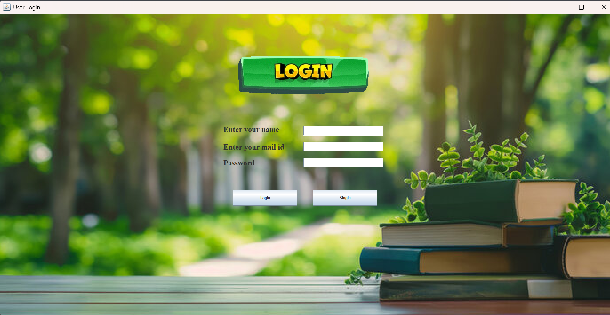
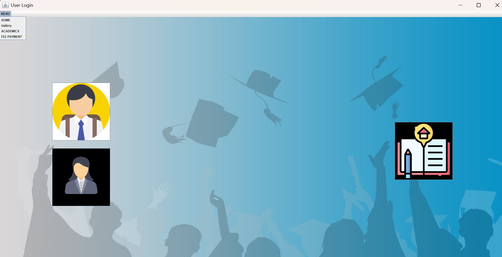
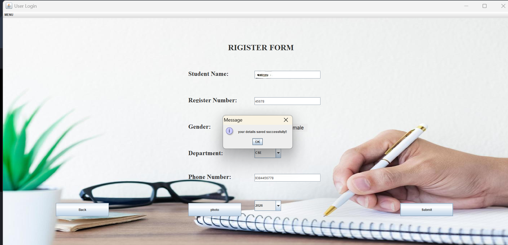
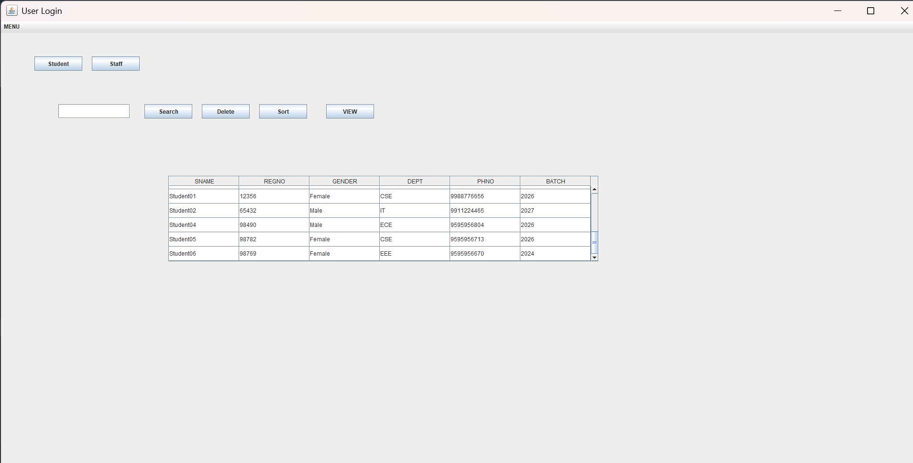
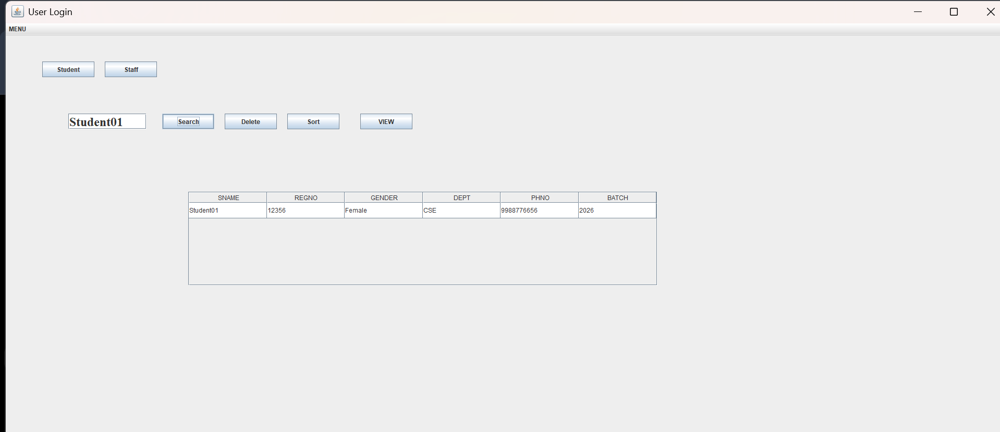

# Student & Staff Management System

A Java Swing-based Student & Staff Management System with Oracle database integration for managing student and staff records efficiently.

## Features

- User login system
- Student registration
- Staff management
- Student record management
- View student records
- Search student records
- Delete records
- Sort records
- Database integration
- Graphical User Interface (GUI)

## Technologies Used

- Java
- Java Swing
- Oracle Database
- JDBC
- Git & GitHub

## Project Structure

```text
student-staff-management-system/
│
├── test10.java
└── README.md

## Application Screenshots

### Login Page


### Dashboard


### Student Registration


### Student Records


### Search
